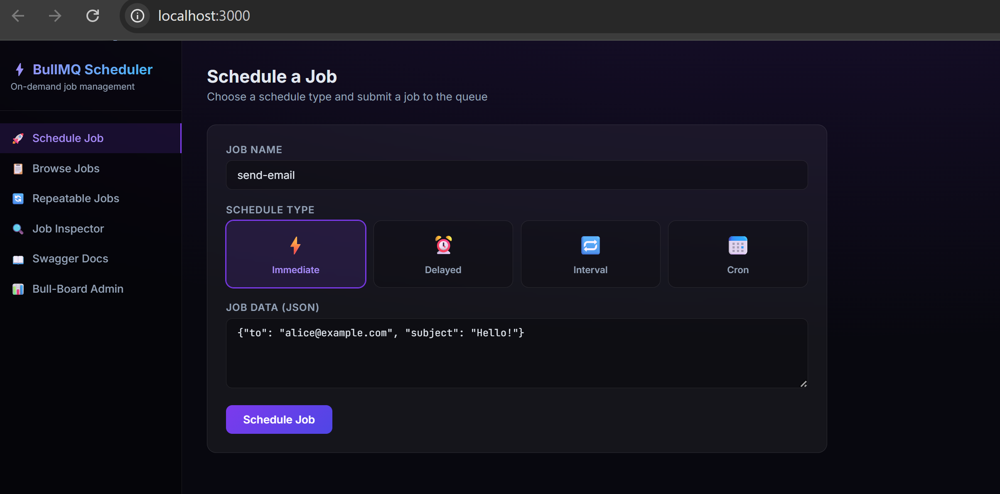
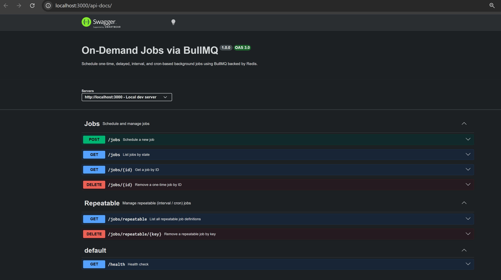
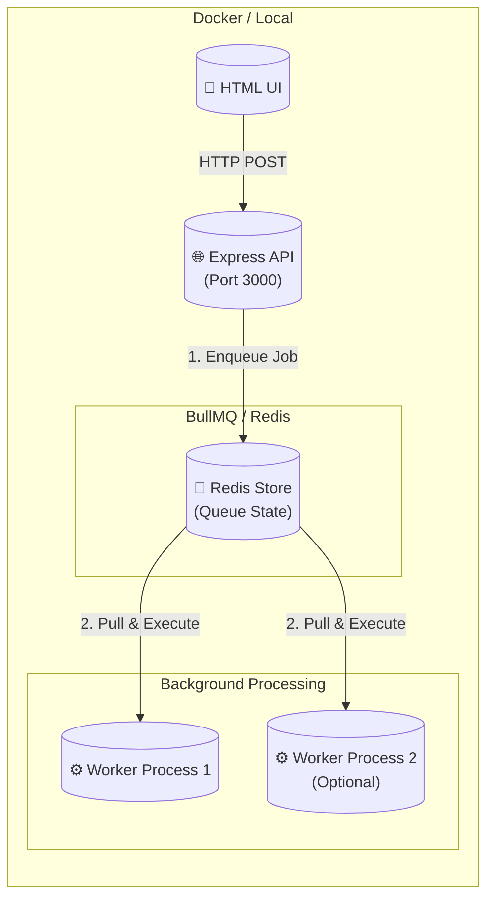

# ⚡ On-Demand Jobs via BullMQ

A fully Dockerized, production-ready Proof of Concept (POC) for scheduling dynamic, on-demand jobs using [BullMQ](https://docs.bullmq.io/), Express, and TypeScript.





> [!WARNING]
> **Disclaimer**: This project is a **Proof of Concept (POC)** and "vibe coded." It is **not production-ready** as-is. While it demonstrates a scalable architecture, it requires further refinement, proper error handling, security hardening, and production-grade monitoring before being deployed to a live environment.

## ✨ Features

- **Four Scheduling Modes**: Immediate, Delayed (one-time), Interval (repeating), and Cron (repeating).
- **Human-Friendly API**: Accept inputs like `"in 2 hours"`, `"tomorrow at 9am"`, or `"30m"` instead of raw milliseconds.
- **Robust Validation**: Powered by `zod`, `ms`, `chrono-node`, and `cron-parser`.
- **Premium UI Dashboard**: Built-in dark-mode dashboard (`/`) to schedule and inspect jobs in real time.
- **OpenAPI 3.0**: Interactive Swagger documentation available at `/api-docs`.
- **Docker Ready**: Runs identically on any machine with `docker compose`.
- **Persistent Redis**: Survives container restarts using Redis AOF.

---

## 🚀 Quick Start (Docker)

The absolute easiest way to run the application is using Docker. You don't even need Node.js installed on your machine.

```bash
# 1. Start the entire stack in the background
docker compose up -d --build

# 2. Check the logs (optional)
docker compose logs -f api worker
```

Once running, open your browser to:
- **Dashboard**: [http://localhost:3000](http://localhost:3000)
- **Queue Admin (Bull-Board)**: [http://localhost:3000/admin/queues](http://localhost:3000/admin/queues)
- **API Docs**: [http://localhost:3000/api-docs](http://localhost:3000/api-docs)

To stop the containers and remove them:
```bash
docker compose down
```
*(Note: Redis data is stored in a Docker volume and will persist. To wipe all jobs and start fresh, run `docker compose down -v`)*

---

## 💻 Local Development (Without Docker)

If you prefer to run the Node server locally while keeping Redis in Docker:

1. **Start Redis**:
   ```bash
   docker compose up -d redis
   ```

2. **Install Dependencies**:
   ```bash
   npm install
   ```

3. **Start the Development Server** (with hot-reload):
   ```bash
   npm run dev
   ```

---

## 🛠 API Usage Examples

The REST API lives at `http://localhost:3000/jobs`. Here are examples of how to schedule different job types.

### 1. Delayed Job (Natural Language)
```bash
curl -X POST http://localhost:3000/jobs \
  -H "Content-Type: application/json" \
  -d '{
    "jobName": "send-email",
    "schedule": { "type": "delayed", "when": "tomorrow at 9am" },
    "data": { "userId": 42 }
  }'
```

### 2. Interval Job (Duration string)
```bash
curl -X POST http://localhost:3000/jobs \
  -H "Content-Type: application/json" \
  -d '{
    "jobName": "cleanup",
    "schedule": { "type": "interval", "every": "2h" }
  }'
```

### 3. Cron Job
```bash
curl -X POST http://localhost:3000/jobs \
  -H "Content-Type: application/json" \
  -d '{
    "jobName": "weekly-report",
    "schedule": { "type": "cron", "pattern": "0 9 * * 1" }
  }'
```

## 🏗 Architecture

The application is fully decoupled. The API and the Worker run as completely separate processes (or separate Docker containers), communicating exclusively through Redis. This allows you to scale the API and background workers independently.



- **`src/server.ts`**: Express API, Swagger, and UI routing. (Runs as `api`)
- **`src/worker.ts`**: Dedicated entrypoint for the background job processor. (Runs as `worker`)
- **`src/queues/jobQueue.ts`**: Shared BullMQ connection configuration.
- **`src/utils/scheduleTranslator.ts`**: Converts human-friendly string inputs to BullMQ internal `JobsOptions`.
